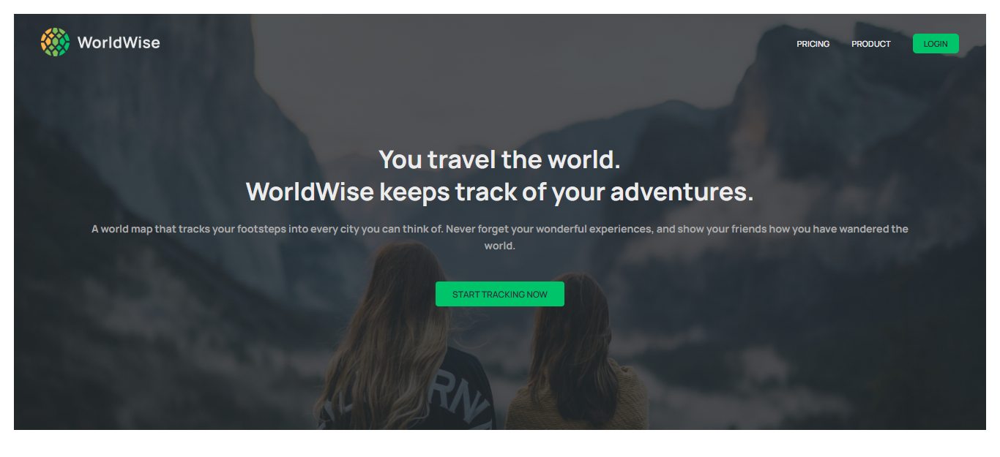
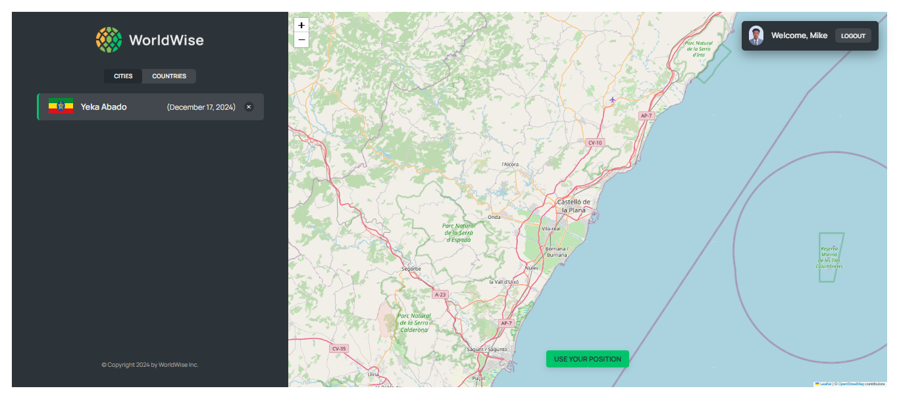
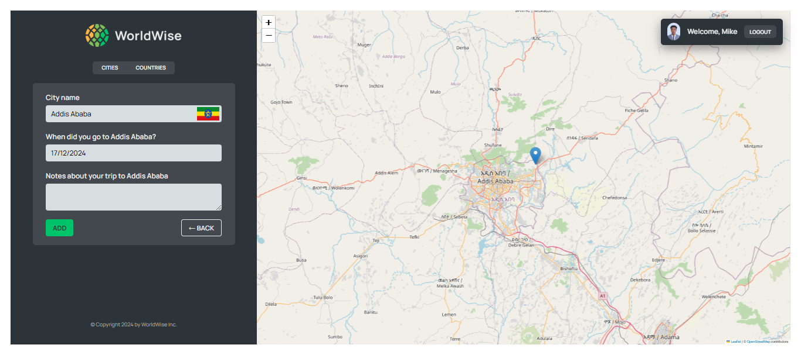

# 🌍 **WorldWise** 🌍  
A feature-rich travel companion app to track visited places, explore destinations, and plan future trips all in a clean and intuitive interface.

---

## 🚀 **Project Overview**  
WorldWise is a modern React application that helps users **mark, visualize, and track** locations they've visited around the globe. Built with best-in-class techniques like **lazy loading**, **memoization**, and **state management**, WorldWise delivers smooth performance for real-world use cases.

---

## 📸 Screenshot
### ✨ **Homepage**  

### ✨ **App**  

### ✨ **Adding New City**  


---

## 🔗 Links

- Github Repo: [Github-link](https://github.com/Mikiyas6/WorldWise)
- Live Site URL: [Page-link](https://mikiyas6.github.io/WorldWise/)

---

## 📚 **Table of Contents**

1. [🚀 Project Overview](#-project-overview)  
2. [✨ Core Features](#-core-features)  
3. [⚙️ Optimizations & Enhancements](#️-optimizations--enhancements)  
4. [🛠️ Tech Stack](#️-tech-stack)  
5. [🔧 Setup Instructions](#-setup-instructions)  
6. [🗒️ Future Enhancements](#️-future-enhancements)  
7. [🧑‍💻 Contributing](#-contributing)  
9. [🌟 Acknowledgements](#-acknowledgements)  

---

## ✨ **Core Features**  

### 🗺️ **Interactive Map Integration**  
- Seamlessly explore the map to **add visited locations**.  
- Visualize travel progress with precise **location markers**.

### 📍 **Add and View Locations**  
- Input key details such as **location name**, **visited date**, and **notes**.  
- Save, update, and view all visited locations in a centralized panel.

### 🌐 **Dynamic Search Functionality**  
- Instantly **filter and search** through saved places.  
- Designed for quick and responsive access to any location.

### 📊 **Travel Insights**  
- Keep track of **number of visited places**.  
- Gain insights into the locations visited with summaries.

---

## ⚙️ **Optimizations & Enhancements**  

### 🎯 **Lazy Loading**  
- Components and heavy assets load **only when needed**, improving initial page load speed.  

### 🔍 **Memoization**  
- Optimized rendering performance using `React.memo` and `useMemo` to prevent unnecessary re-renders.  

### 🌟 **State Management**  
- Managed efficiently using React's `useState` and `useReducer` for better data flow across components.  

---

## 🛠️ **Tech Stack**  
- **Frontend**: React, React Hooks  
- **State Management**: Context API  
- **Performance Optimization**: Lazy Loading, React Memo, useMemo  
- **Styling**: CSS Modules  
- **Map Integration**: Leaflet.js  
- **Deployment**: Netlify  

---

## 🔧 **Setup Instructions**  

1. Clone the repository:  
   ```bash
   git clone https://github.com/Mikiyas6/worldwise.git
   cd worldwise
   ```

2. Install dependencies:  
   ```bash
   npm install
   ```

3. Start the development server:  
   ```bash
   npm start
   ```

4. View the project in your browser at `http://localhost:3000`.

---

## 🗒️ **Future Enhancements**  

- **Offline Support**: Allow users to add locations without internet access.  
- **User Authentication**: Save and sync data across devices.  
- **Travel Statistics**: Generate insights like total kilometers traveled and top countries visited.  
- **Dark Mode**: Provide a visually appealing dark theme option.  

---

## 🧑‍💻 **Contributing**  
Pull requests and issues are welcome! Here's how you can contribute:  
1. Fork the repository.  
2. Create a feature branch: `git checkout -b feature-new-feature`.  
3. Commit your changes: `git commit -m "Add new feature"`.  
4. Push the branch: `git push origin feature-new-feature`.  
5. Submit a pull request.  

---

## 🌟 **Acknowledgements**  
- Built using React and Leaflet.js for a smooth and interactive user experience.


